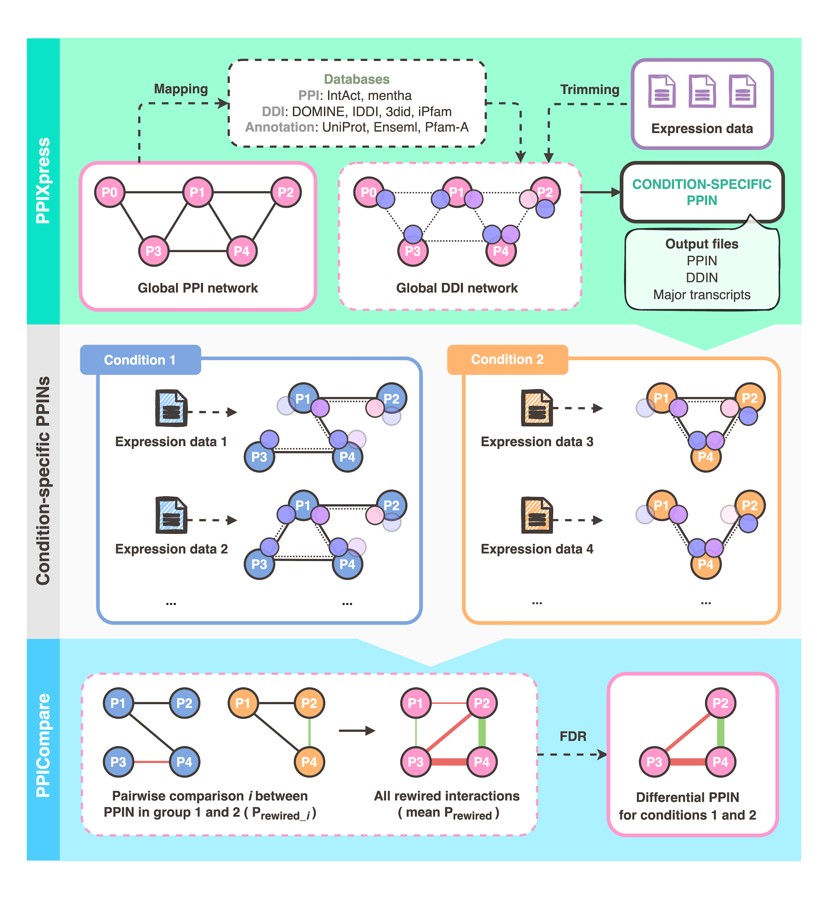

# PPI Webservers
## PPIXpress and PPICompare
<ul>
  <li>PPIXpress and PPICompare are two webservers that enable analysis of protein-protein interaction networks (PPINs). </li>
  <li>Given a reference PPIN and user-uploaded expression data from multiple samples, PPIXpress constructs context-dependent PPINs based on major transcripts and high-confidence domain interactions data. </li>
  <li>To derive a differential PPIN that distinguishes two groups of contextualized PPINs, PPICompare identifies statistically significant altered interactions between multiple context-dependent PPINs from PPIXpress. </li>
</ul>

## Availability
PPIXpress and PPICompare webservers are available at 
https://service.bioinformatik.uni-saarland.de/ppi-webserver/index_PPIXpress.jsp and
https://service.bioinformatik.uni-saarland.de/ppi-webserver/index_PPICompare.jsp

## News and Updates:
Application updates can be found at https://service.bioinformatik.uni-saarland.de/ppi-webserver/
